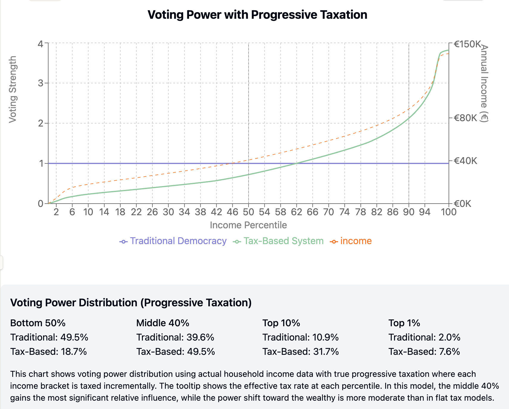

Our current international system fails to address collective challenges that transcend borders. Climate change accelerates without adequate enforcement mechanisms. AI development proceeds with minimal coordination, creating risks as nations and corporations compete without adequate safety protocols. While centuries of diplomatic evolution have occurred, armed conflict remains the ultimate arbiter when national interests clash, with military spending exceeding $2 trillion annually. Our interconnected world's governance remains fragmented, leaving humanity unable to effectively address existential threats.

## Requirements for a Viable Global System

For a governmental system to scale globally, it must satisfy a fundamental requirement: two arbitrary countries that have already implemented this system must find merging advantageous. Any viable global governance structure must create natural incentives for political unification. When nations combine under this framework, they must gain tangible benefits—efficiency through reduced duplication, increased bargaining power, and enhanced security—while maintaining appropriate influence for all stakeholders. Only a system that makes merger mutually beneficial can spread organically to achieve true global scale.

## Why Traditional Democracy Prevents Mergers

Consider a potential merger between Luxembourg and India under a one-person-one-vote democratic system. Luxembourg, with its 650,000 citizens, would immediately see its political influence diluted to statistical irrelevance within India's 1.4 billion population. Luxembourg citizens would effectively lose all sovereignty, controlling just 0.05% of votes in the combined entity. No rational Luxembourg government would agree to such terms, regardless of economic benefits. Similarly, smaller U.S. states would never have joined the union without constitutional protections beyond pure population-based representation. When formal voting power is based solely on population, economically or militarily powerful but less populous entities have no incentive to participate, as they would be systematically outvoted on issues affecting their core interests.

## The Myth of Pure Democracy

What are commonly called "democracies" are actually hybrid systems where economic power significantly influences political outcomes. Wealthy individuals and corporations shape policy through campaign financing, lobbying, think tank funding, and media ownership. Studies consistently show correlation between policy outcomes and preferences of economic elites rather than average voters. This isn't corruption of democracy—it's the inevitable expression of power through available channels.

## The Power Formalization Principle

Instead of pretending this dynamic doesn't exist, we could design a system that explicitly acknowledges these power realities. The fundamental premise: structure governance to reflect the actual power that people and entities possess, so that decisions made through governmental systems mirror what would happen if they "fought it out" in the real world—but without the waste of actual conflict. By bringing power into the formal system rather than allowing it to operate in the shadows, we create both transparency and stability.

## Tax Contributions as Power Metric

We propose tax contributions as the central metric for measuring power in our system. Paying taxes demonstrates both capacity (having resources to contribute) and commitment (willingness to deploy those resources for collective purposes). This provides a concrete, verifiable measurement of power that's difficult to falsify. Rather than allowing wealth to translate into political power through hidden channels like campaign contributions, this system would create a direct, transparent relationship between economic contribution and political influence. Tax contributions would confer voting power for a defined period—perhaps one year—after which they expire if not renewed.

The widespread adoption of one-person-one-vote systems suggests this approach captures some meaningful aspects of power distribution in society. People's ability to organize, protest, and potentially rebel gives them collective power that any sustainable system must acknowledge. However, there is no easy way to measure this form of power so that we can compare it directly to tax contributions. We'll explore potential options for integrating collective action power metrics in an appendix.

## The Power Shift

In our tax-based system, voting power shifts to align with tax contributions. Based on real household income distribution data from the Netherlands in 2024, we see the following:

## What Happens to the Bottom 50%?

Under our tax-based system, the bottom 50% of income earners would see their formal voting power decrease from 49.5% to 18.7%. Yet this doesn't necessarily mean their interests would be ignored. In current democratic systems where the middle class theoretically holds majority power, we still observe substantial welfare programs and redistributive policies. This occurs because political power isn't exercised in isolation—it operates within social contexts where moral considerations influence decision-making. Wealthy contributors have enlightened self-interest in maintaining social stability, preventing extreme inequality, and developing human capital across all economic levels. Furthermore, the tax-based system makes power transparent and measurable, unlike current systems where influence operates through hidden channels. This transparency creates accountability and enables advocacy focused on specific power imbalances rather than nebulous "special interests." When the bottom 50% can clearly see their voting power and how decisions affect them, they can more effectively organize to protect their interests within the system.

## Conclusion

Addressing existential challenges like climate change, AI risks, and armed conflict requires effective global governance. Our current fragmented international system consistently fails to coordinate responses to planetary-scale threats. The tax-based power system outlined here offers a viable path to global governance by creating natural incentives for political integration. By formalizing the relationship between resource contribution and political influence, it enables nations to merge their governance structures voluntarily, knowing their interests will be represented proportionally to their contributions. Unlike idealized democratic systems that ignore power realities, this transparent approach acknowledges and channels existing power dynamics constructively. The stakes could not be higher—humanity's continued flourishing depends on our ability to coordinate at global scale. This system doesn't promise utopian equality, but it does offer something more valuable: a practical path toward the unified governance we desperately need to face our greatest challenges.

## Appendix: Formalizing Protest Power

Beyond tax contributions, our system needs a mechanism to measure and incorporate the power of collective action and protest. We propose two potential frameworks:

### Option 1: Community Participation Credits

Under this approach, the government would create a formal Community Participation program where citizens earn voting power through activities that traditionally occur through protest. Citizens could register for designated public service roles focused on systemic critique and advocacy. Participants would identify social problems, organize community responses, and develop policy proposals—essentially formalizing productive aspects of protest within the system.

Voting power earned would be determined through a transparent formula considering hours contributed, impact of proposals, and community endorsement. This approach channels protest energy through formal systems while providing clear metrics for translating this participation into political influence. It acknowledges that identifying problems and advocating for the marginalized represents valuable work worthy of political recognition.

### Option 2: Power Simulation Games

A more experimental approach involves creating physical or digital "protest simulations" that measure the potential disruptive power of collective action without requiring actual disruption. Citizens could register as "protesters" in periodic government-sponsored simulations, while other participants function as "response forces" representing institutional resistance.

These controlled exercises would follow strict safety protocols while measuring key power metrics: the protesters' ability to organize, persist despite obstacles, recruit supporters, and potentially disrupt economic activity. The measured impact would translate to voting power credits for participants based on demonstrated effectiveness.

This gamified approach allows for empirical measurement of collective action power without social disruption. It creates a controlled environment where those who would otherwise resort to actual protests can demonstrate their potential power and receive corresponding political influence. The system would need careful design to prevent gaming or manipulation, with transparent rules and independent oversight.

Either approach seeks to formalize what happens informally in current systems: the translation of collective action into political influence. By creating clear metrics and channels for this power expression, we acknowledge the legitimate role of protest in healthy governance systems while reducing its unpredictable and potentially destructive manifestations.