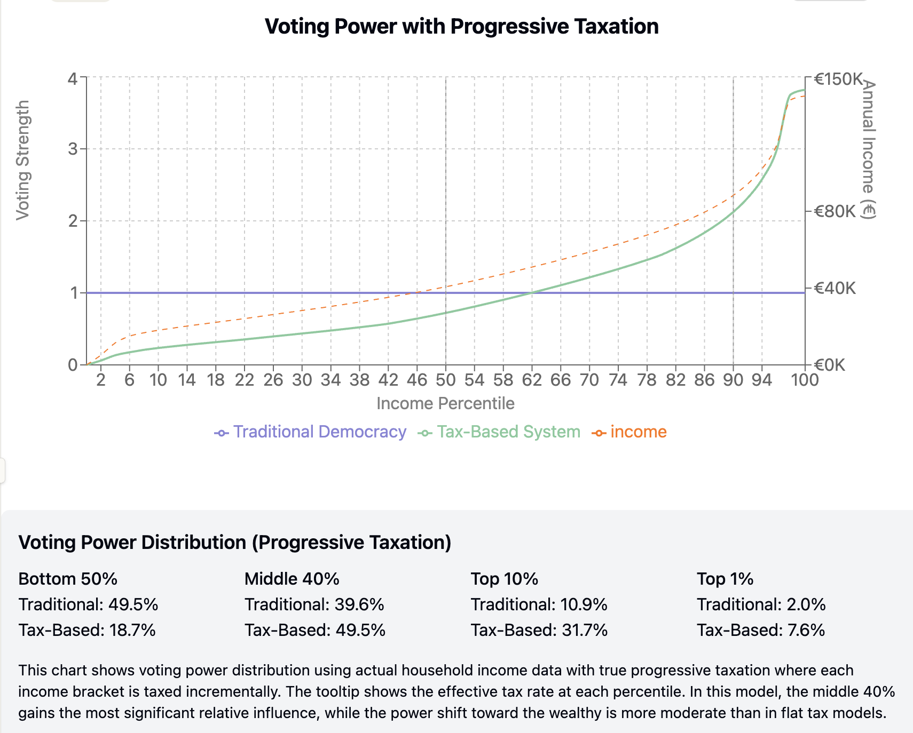

# Designing a Viable Global Government

## The Global Governance Crisis

Our current international system fails to address collective challenges that transcend borders. Climate change accelerates without adequate enforcement mechanisms. AI development proceeds with minimal coordination, creating risks as nations and corporations compete without adequate safety protocols. Despite centuries of diplomatic evolution, armed conflict remains the ultimate arbiter when national interests clash, with military spending exceeding $2 trillion annually. Despite our interconnected world, governance remains fragmented, leaving humanity unable to effectively address global challenges.

## Requirements for a Viable Global System
For a governmental system to scale globally, it must satisfy a fundamental requirement: two arbitrary countries that have already implemented this system must find it advantageous to merge into one. Any viable global governance structure must create natural incentives for political unification. When nations combine under this framework, they must gain tangible benefits—efficiency through reduced duplication, increased bargaining power, and enhanced security—while maintaining appropriate influence for all stakeholders. Only a system that makes merger mutually beneficial can spread organically to achieve true global scale.

## The Limitations of Scaling Current Democratic Systems

A logical first approach to global governance would be to simply scale up our existing democratic systems—one person, one vote across the entire planet. After all, this is the model most nations currently use internally. However, when expanded to global scale, such a system would likely prove dangerously unstable. When formal voting power significantly diverges from actual power capabilities, powerful actors would inevitably undermine the system rather than accept unfavorable outcomes. We already see this pattern in existing democracies, where campaign financing, lobbying, and media influence allow wealthy individuals and corporations to gain political power far beyond their single vote. A global democracy would face these same issues at unprecedented scale. Nations with military strength, corporations with economic leverage, and wealthy individuals would either physically overthrow the system through force or subvert it through established methods of influence. Democracy doesn't eliminate power imbalances; it merely forces power to express itself through hidden channels rather than transparent ones.

## The Failure of Campaign Finance Reforms
Some might argue that we could simply regulate away the influence of money in politics through campaign finance laws or limits on political contributions. History has shown this approach to be largely ineffective. When formal channels for power expression are blocked, influence simply redirects through increasingly complex and less transparent mechanisms. Wealthy entities fund PACs, think tanks, media organizations, or astroturf movements instead of direct campaign contributions. They invest in lobbyists, legal challenges, or strategic philanthropy that advances their interests. The fundamental problem remains: actual power will always find expression, whether through formal channels or informal ones. The more we attempt to suppress it through regulation, the more sophisticated and hidden its manifestations become. This regulatory cat-and-mouse game ultimately undermines transparency and accountability while failing to achieve genuine political equality.

## The Power Formalization Principle

What if, instead of ignoring these power realities, we designed a global governance system that explicitly acknowledges and formalizes them? The fundamental premise of our proposed system is straightforward: structure governance to reflect the actual power that people and entities possess, so that decisions made through governmental systems mirror what would happen if they "fought it out" in the real world—but without the waste of actual conflict. By bringing power into the formal system rather than allowing it to operate in the shadows, we create both transparency and stability. This isn't about endorsing power imbalances, but rather acknowledging their existence and channeling them constructively.

## Tax Contributions as the Ideal Power Metric

How would we measure this power objectively? We propose tax contributions as the central metric. When someone pays taxes, they demonstrate both capacity (having resources to contribute) and commitment (willingness to deploy those resources for collective purposes). This provides a concrete, verifiable measurement of power that's difficult to falsify. Rather than allowing wealth to translate into political power through hidden channels like campaign contributions, this system would create a direct, transparent relationship between economic contribution and political influence. Those who contribute more resources to the collective gain more say in how the collective operates—a formalization of what already happens, but with accountability.

## Visualizing the Power Shift
To understand how this system differs from traditional democracy, let's examine the distribution of voting power across income percentiles using actual household income distribution data. In a traditional one-person-one-vote system, voting power is distributed equally regardless of income or contribution. In our proposed tax-based system, voting power shifts to align with actual tax contributions, which follows progressive taxation rates applied to income.
The chart below illustrates this power distribution shift based on real household income data with progressive taxation rates. The traditional democracy line remains flat (everyone has equal power), while the tax-based system line shows voting power increasing with income percentile. The dotted orange line shows actual annual income (right axis).

This visualization based on real data reveals several important aspects of the proposed system:

The bottom 50% of income earners would see their collective voting power decrease from 49.5% to 19.2% of the total.
The middle 40% (50th-90th percentiles) would gain influence, with their collective voting power increasing from 39.6% to 51.0%.
The top 10% would see their voting power increase from 10.9% to 29.8%.
The top 1% would control 6.7% of voting power (compared to 2.0% in traditional democracy).

Perhaps surprisingly, this data-driven model shows that the middle class would actually gain the most relative power under this system. The shift is less extreme than theoretical models might suggest, with the top 1% gaining significant but not overwhelming influence. It's also important to recognize that in current democratic systems, the formal equality of "one person, one vote" is already significantly undermined by informal influence channels like lobbying, media ownership, and campaign financing. The tax-based system doesn't create new power disparities—it simply brings existing ones into the formal system where they can be transparently measured, discussed, and addressed.

## The Case for Optimism About the Vulnerable
Historical evidence suggests the powerful won't simply neglect the vulnerable in this system. Even in current democracies where the middle class holds majority voting power, we see significant social welfare programs and redistribution that benefit the poorest members of society. Wealthy nations voluntarily contribute billions in foreign aid and development assistance annually. Throughout history, we've seen powerful countries withdraw from exploitative arrangements like colonization and slavery—often due to moral evolution rather than merely economic calculations. These examples demonstrate that transparency, moral progress, and enlightened self-interest can motivate the powerful to consider broader welfare beyond narrow self-interest. A tax-based global system would formalize power while maintaining these important social dynamics, with the added benefit that contributions to help the vulnerable would directly translate to greater voice in how such programs are implemented.

## Application to Global Challenges

Applied to pressing global issues like climate change, this system offers unique advantages. Currently, climate agreements struggle with free-rider problems and lack of enforcement. Under a tax-based power system, those contributing resources to climate solutions would gain increased influence over environmental policy, creating direct incentives for action. Similarly with advanced AI development, entities deploying resources toward responsible innovation and safety would gain more say in regulation than those merely pursuing capability without consideration of risks. The system naturally rewards those who commit resources to solving problems rather than just talking about them.

## Implementation Pathways

Implementation would follow a straightforward regional adoption pattern. The system would first be established in a single willing region or nation, demonstrating its stability and effectiveness in practice rather than theory. Neighboring regions, observing these benefits—particularly economic efficiency and conflict reduction—would have natural incentives to adopt similar systems. Regions using compatible power measurement frameworks could then merge into larger governance units, gradually expanding the scope of unified governance. This organic growth approach avoids the need for simultaneous global agreement, which history suggests is nearly impossible to achieve. Instead, the system would expand based on demonstrated success and mutual benefit, eventually reaching global scale through a series of regional integrations.

## Dynamic Power Measurement

The system needs to reflect current power rather than historical contributions. A straightforward fixed-period approach works effectively: tax contributions confer voting power for a defined period—perhaps one year—after which they expire if not renewed through continued contributions. This creates a clear, understandable relationship: your current power reflects your recent contributions, not what you did decades ago.

This fixed-period model has several advantages. It's simple to understand and implement. It creates a continuous incentive to remain economically productive. It prevents the accumulation of permanent political power without ongoing contribution. And it allows for relatively rapid power shifts as economic circumstances change. Anyone who generates new value and contributes to the collective can gain influence within a predictable timeframe, while those who cease contributing would lose their power at a known point.

## Conclusion: From Hidden to Transparent Power

The tax-based power system represents a fundamental rethinking of governance for the global age. Rather than clinging to democratic idealism disconnected from power realities, it creates honest, functional structures that channel power constructively. By formalizing what already exists—the relationship between resource contribution and political influence—it brings transparency to processes that currently operate in shadows. Most importantly, it offers a path beyond the age of war, replacing violent power contests with peaceful, institutionalized processes that reflect the same realities but without destruction. The choice before us isn't between perfect equality and power politics; it's between hidden power and transparent power. In facing existential global challenges, transparency might make all the difference.